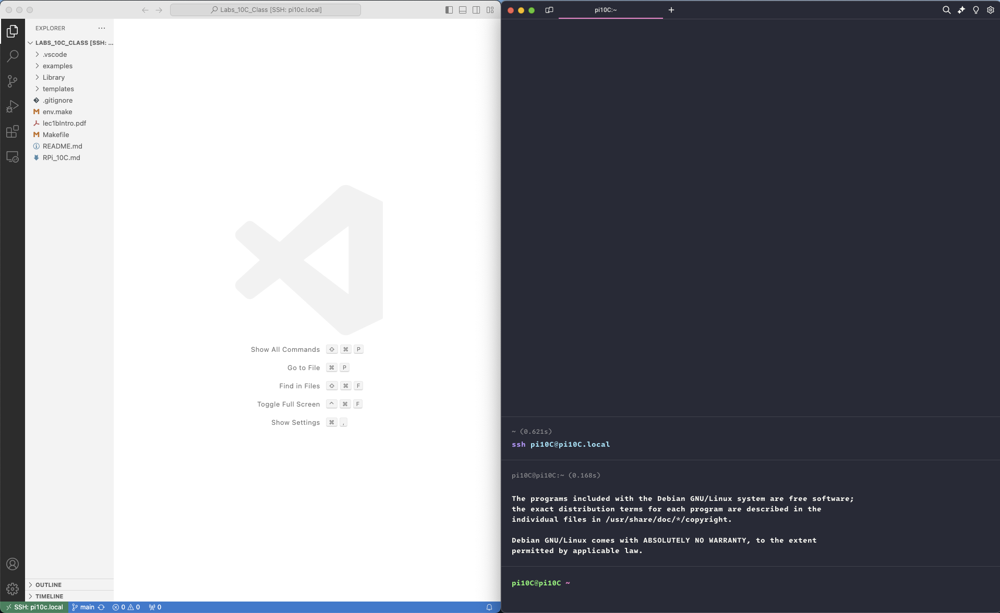

# MPC 10C Labs for the Arduino Uno R3
### Using *C*: Classroom Edition Fall 2024

## Introduction
This repository is for an introductory course on the *C* language using the Arduino Uno, the *C* tool chain (avr-gcc, avrdude etc) and the [*AVR C Library*](https://github.com/lkoepsel/AVR_C). The content is for students who desire understanding *C* using an embedded microcontroller, in this case the *Arduino Uno R3*. This content uses the *avr* tool chain via command line (also called the *terminal*), it doesn't use the Arduino IDE GUI nor does it use the Arduino software framework.  

The directory, *templates*, contains the programs for labs. Each template folder contains multiple folders, each folder is a specific programming exercise. Within each exercise folder is a file called *main.c* and a file called *Makefile*. The file *main.c* is the template for the exercise and the *Makefile* is the required file using *make* to compile/link/load it to an UNO. Think of the *main.c* file as the Arduino IDE sketch and the *Makefile* as a command-line version of the *Arduino IDE*. The files in *Library* are similar to those found in the *Arduino framework library*.

## Dependencies
The approach this class follows is to use a standardized platform running the *C* tool chain. This removes the pain of having to maintain documentation and support for each of the major computing platforms, *macOS*, *Windows* and *Linux*. Instead, the platform will be an inexpensive *Raspberry Pi (RPi)* running *Raspberry Pi OS Bookworm* with all of the required programs pre-installed.

In order to use this content you need to have the following installed on **your** computer or a computer you will be using in class:

* **VS Code** - Code editor, able to connect remotely to the  RPi
* **Terminal** - command line interface, *part of each operating system*

## Additional Sources of Information

* [Developing in C on the AVR ATmega328P](https://www.wellys.com/posts/courses_avr_c/) A series of web pages explaining in detail how to use specific aspects of the AVR C software framework.
* [AVR LibC](https://www.nongnu.org/avr-libc/) This library is the basis for the *C*language for the AVR. From GNU "*AVR Libc is a Free Software project whose goal is to provide a high quality C library for use with GCC on Atmel AVR microcontrollers.*" 

## Directories
**Note: *Library* and *examples* will be maintained identical to the [AVR_C versions](https://github.com/lkoepsel/AVR_C)**

* *examples* - contains code demonstrating how to use specific functions in the Library
* *Library* - *AVR C Library*, specific Arduino functions rewritten in *C* such as analogRead(), analogWrite(), digitalRead(), and pinMode()
* *templates* - template directories for each of the lab execises. This directory must be duplicated to be used and called *dev*. **This directory is tracked by git and could be over-written in the next clone operation.**
* *dev* - the student's version of the templates directory, where the students will make changes to the lab files. **This directory is not tracked by git and won't be overwritten.**

## Installation

For this class, all of the content will be pre-installed on the *RPi*. If you wish to create a similar *RPi* from scratch, [here](./docs/RPI_10C.md) are the instructions. 

## Usage
The recommended method to develop code using this repository is to use *VS Code* and your *terminal* program, side-by-side. This allows you to quickly and easily perform functions in either window.

### VS Code Steps
In the steps below, *Ctrl/CMD* means press *Ctrl* on Windows/Linux or *Command* on a Mac.

1. Open *VS Code* on your computer.
1. Press *Shift-Ctrl/CMD-P*, to *Show All Commands* in *VS Code*.
1. Enter "*remote*" and click on "*Remote-SSH: Connect to Host...*"
1. Enter your *RPi* username and hostname like this: *pi10C@pi10C01.local*
1. Enter your password when prompted
1. It will take a few minutes for *VS Code* to connect, then it will prompt for a folder to open.
1. Click on the blue box *Open Folder* then click on *Labs_10C_Class* in the selection dropdown. **ALWAYS OPEN THE FOLDER AND NOT INDIVIDUAL FILES**, it will make your life much easier!
1. If prompted, click on "Yes, I trust the Authors".
1. Make the *VS Code* window fill the left half of your monitor screen.

### Terminal Steps

1. In Windows, enter *Terminal* in the Windows search bar, click on either *Terminal* or *Command Prompt*. On a Mac, press *Cmd-Space* to pull up the search and enter *Terminal* then return.
1. Make the *Terminal* window fill the right half of your monitor screen.
1. In the window, which opens enter *ssh *pi10C@pi10C01.local*, using your *RPi* username and hostname.
1. If this the first time, you have connected, you will need to respond "*yes*" to "*...continue connecting (yes/no/[fingerprint])?*".

It will look similar to this:
```bash
ssh pi10C@pi10C01.local
The authenticity of host 'pi10c01.local (192.168.1.75)' can't be established.
ED25519 key fingerprint is SHA256:1xivnuODhnLQR0VzTC4JIlHzYzZ9/6zm9R/gjh6/TIo.
This key is not known by any other names.
Are you sure you want to continue connecting (yes/no/[fingerprint])? yes
Warning: Permanently added 'pi10c.local' (ED25519) to the list of known hosts.
pi10C@pi10c.local's password:
```
This will connect your computer to the *RPi* via a secure connection (*SSH*) and you will now be in the *command line interface (CLI)* of the *Raspberry Pi*.

Your screen now similar to this, with *VS Code* on the left and *Terminal* on the right:



## Confirm Working System

### Confirm in Terminal

**Plug the USB cable into the Uno and into the Raspberry Pi.**

To confirm everything is setup correctly, please perform the following steps in your *Terminal*:
```bash
# change directories to the Labs folder
cd Labs_10C_Class/
cd examples/blink
make complete
```

If everything is successful, you will see the end of the screen printout look like this:
```bash
avrdude: AVR device initialized and ready to accept instructions

Reading | ################################################## | 100% 0.00 s

avrdude: device signature = 0x1e950f (probably m328p)
avrdude: Note: flash memory has been specified, an erase cycle will be performed.
         To disable this feature, specify the -D option.
avrdude: erasing chip
avrdude: reading input file main.hex for flash
         with 1698 bytes in 1 section within [0, 0x6a1]
         using 14 pages and 94 pad bytes
avrdude: writing 1698 bytes flash ...

Writing |                                                    | 0% 0.00 s avrdude: padding flash [0x0680, 0x06ff]
Writing | ################################################## | 100% 0.36 s

avrdude: 1698 bytes of flash written

avrdude done.  Thank you.
```

And your Uno will be blinking quickly (2.5 times per second).

### Confirm in VS Code

Now switch to the *VS Code* window. 
1. Make sure the top icon in the left-side panel is selected to view your files. The second panel will show *EXPLORER* at the top.
1. Click on the ">" to the left of examples, to show the folders.
1. Click on the ">" to the left of the folder *blink*
1. Click on *main.c* to show the file in the main *Editor* window
1. Go to line 10 and change *200* to *1000*
1. Press Shift-Ctrl/CMD-b and press return (*compile and upload code (upload): flash*)
1. After a small delay to compile and upload the code, the Uno will be blinking much slower

**If both tests worked, you are now ready to code!!!**


