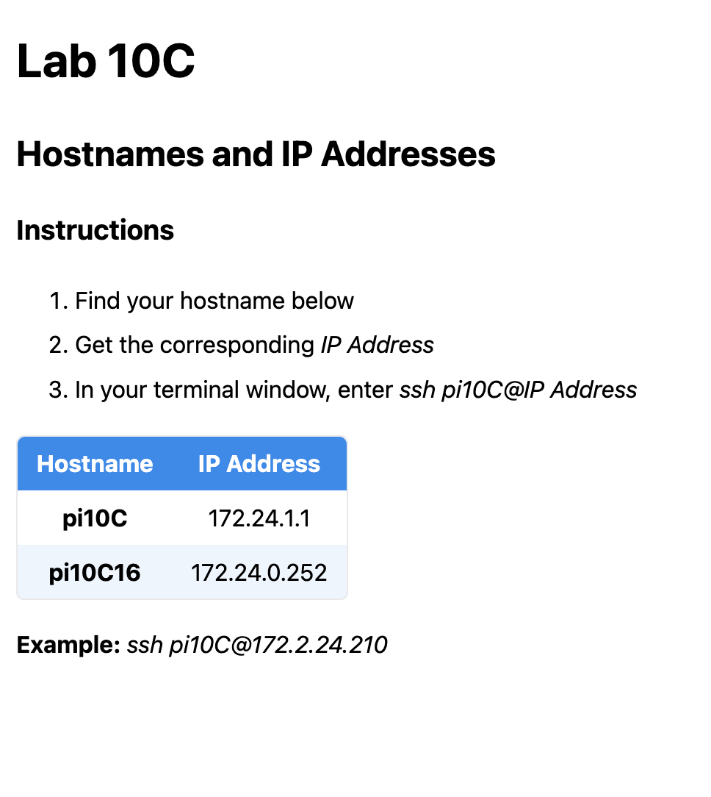

# Pi10C Hello Server Instructions

These instructions are for the instructor to run the *hello server*.

## Easy Startup
Connect to the *hello_server*
```bash
ssh pi10C@pi10c.local
```

Start the server
```bash
cd
cd hello
sudo python -m hello_server_v2
```

Once the server starts, you will see:
```bash
... multiple lines of output
 * Running on http://172.24.1.1:80
 ... multiple lines of output
```

Ask the students to browse to the address above, for this example: *http://172.24.1.1*. **Note** This is not a secure address, some browsers might complain.

The browser window will look like this:
 

The student can look for their *Raspberry Pi hostname* then use the corresponding IP address to connect to the *Pi* in the form *ssh pi10C@172.24.0.252*. This example uses the *IP Address* for pi10C16 in the image above.

## Annotated Startup
1. Plug in the pre-configured *Raspberry Pi* which will serve as the *Pi10C hello server*.
2. Connect to it via *ssh pi10C@pi10c.local*.

    **NOTE:** Connecting via *hostname.local* requires *bonjour/avahi* capability on your system. For all macOS systems, this is already installed, for most Linux installs it is part of the default installation, and on Windows, it doesn't exist. 
The solution on Windows, is to install WSL 2 and run WSL at the command prompt. This still might have an issue, if so, see *Links for Solving Windows mDNS*, below.
3. Once connected to the *hello_server*, switch to the *hello* directory: *cd hello*.
4. To start the server enter: sudo python -m hello_server_v2. It requires *sudo* as the *flask* application uses port 80, to simplify connection. 

The command line program will also show IP addresses for specific hostnames in the form of the following:
```bash
Received text: pi10C09 from IP: 172.24.1.91
```
You may also use this line to provide the student with their *IP Address*.

**NOTE: Keep the server running for all students to see their IP Address. Restarting the server, will lose the pre-existing IP Addresses.**

If a restart is required, ask the student to enter the following on their command line:
```bash
sudo systemctl start hello.service
```


## Links for Solving Windows mDNS 
* [mDNS stopped working in WSL2 after Windows 11 Pro update · Issue #11022 · microsoft/WSL · GitHub](https://github.com/microsoft/WSL/issues/11022)
* [Accessing network applications with WSL | Microsoft Learn](https://learn.microsoft.com/en-us/windows/wsl/networking)
* [Advanced settings configuration in WSL | Microsoft Learn](https://learn.microsoft.com/en-us/windows/wsl/wsl-config)